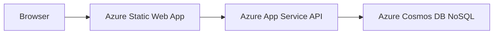

# Step 01 - Understand the Free-First Architecture (Beginner Guide)

Goal: know exactly what will run where, and why this design is needed.

## Target architecture

1. Frontend: Azure Static Web Apps (Free).
2. Backend API: Azure App Service (Free F1).
3. Database: Azure Cosmos DB for NoSQL (Free Tier).

## Why this differs from your current code

1. Your current backend uses PostgreSQL + EF Core + ASP.NET Identity relational tables.
2. PostgreSQL on Azure is not permanently free.
3. Cosmos DB Free Tier is the Azure-friendly free-first database option.

## Architecture diagram

## What changes in the app

1. Frontend mostly stays the same.
2. Backend storage and auth persistence must move from SQL to Cosmos documents.
3. JWT auth remains, but user data store changes.

## Skills needed (no prior experience assumed)

1. How to create Azure resources in portal.
2. How to set app settings (environment variables).
3. How to verify app logs and browser network requests.

## Verification checklist

1. You can explain what each Azure service does.
2. You understand why PostgreSQL is not used in this free-first plan.

## Done when

- You are clear on the architecture and expected code migration scope.
